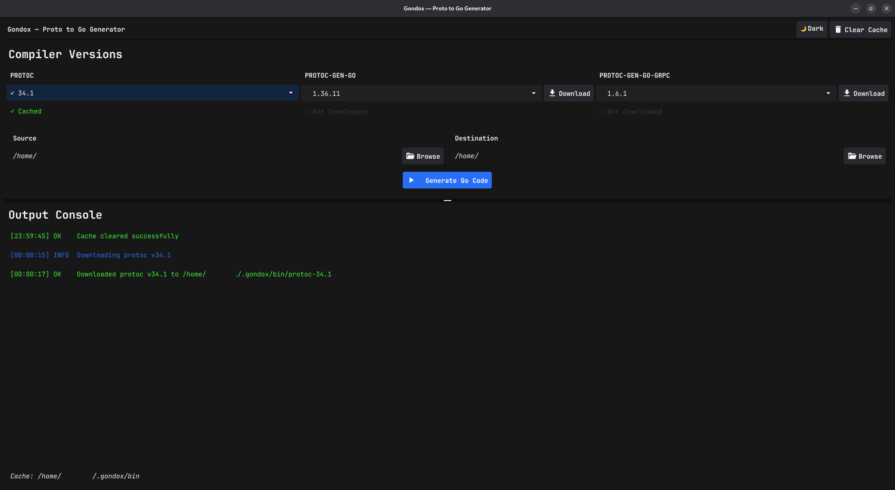

# Gondox

A desktop GUI for generating Go code from `.proto` files using pinned `protoc`, `protoc-gen-go`, and `protoc-gen-go-grpc` versions.

Built with Go and Fyne.



## Features

- Desktop UI for Proto → Go code generation
- Version selectors for:
  - `protoc`
  - `protoc-gen-go`
  - `protoc-gen-go-grpc`
- Per-version download buttons for missing binaries
- Checkmark indicators in selectors for binaries already present in local cache
- Local binary cache management, including **Clear Cache**
- Local version-list caching to reduce repeated GitHub API requests
- Graceful fallback to cached version lists when GitHub rate limits are hit
- Automatic download of common `google/protobuf/*.proto` includes during generation
- Rich log console with color-coded log types
- Light/Dark theme toggle
- Embedded JetBrains Mono font for a consistent UI

## Project Structure

```text
main.go                  # application entrypoint
internal/ui/             # Fyne desktop UI
internal/cache/          # binary cache helpers
internal/downloader/     # compiler/plugin download logic
internal/runner/         # protoc execution logic
internal/versions/       # GitHub version fetching + version-list cache
```

## Requirements

- Go `1.23` or newer
- A desktop environment supported by Fyne

> Note: Fyne desktop apps may require platform GUI dependencies. If `go run .` fails with GUI-related errors, install the dependencies recommended by Fyne for your OS.

## How It Works

1. Gondox loads version lists for the compiler/plugin selectors.
2. If a version list was fetched previously, it is read from local cache first.
3. You choose:
   - `.proto` source directory
   - generated Go output directory
4. If selected binaries are not downloaded yet, use the **Download** buttons beside each selector.
5. Click **Generate Go Code**.
6. Gondox runs `protoc` with the selected toolchain and writes logs to the built-in console.

During generation, Gondox also prepares a local cache of common protobuf includes such as:

- `google/protobuf/timestamp.proto`
- `google/protobuf/empty.proto`
- `google/protobuf/any.proto`
- `google/protobuf/wrappers.proto`

This helps reduce missing-import errors for common protobuf types.

## Cache Locations

By default, Gondox stores data under:

```text
~/.gondox/
```

Typical subdirectories include:

```text
~/.gondox/bin/         # downloaded binaries
~/.gondox/versions/    # cached version lists
~/.gondox/includes/    # cached common protobuf includes
```

## Run the App

From the project root:

```zsh
go run .
```

## Build a Binary

```zsh
go build -o gondox .
./gondox
```

## Run Tests

```zsh
go test ./...
```

## Optional Environment Variables

Gondox supports a few cache overrides used by the codebase:

```text
GONDOX_VERSION_CACHE_DIR   Override version-list cache directory
GONDOX_COMMON_PROTO_DIR    Override common protobuf include cache directory
```

These are useful for testing, CI, or running with custom cache locations.

## Example Usage

1. Start the app.
2. Wait for version lists to load.
3. Pick versions from the selectors.
   - Options prefixed with `✓` are already downloaded in cache.
4. Use **Download** for any missing compiler/plugin version.
5. Select your source and destination folders.
6. Click **Generate Go Code**.
7. Review the colorized console logs for progress and errors.

## Current Behavior Around GitHub Limits

- Version lists are cached locally after a successful fetch.
- On later launches, Gondox uses the local cached version list first.
- If GitHub rate limiting occurs, Gondox logs a warning and continues using cached data when available.

## License

This project is licensed under the MIT License. See [`LICENSE`](./LICENSE).

